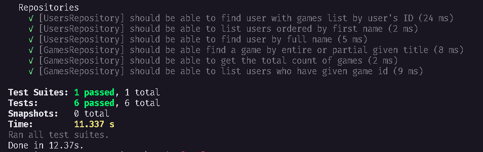
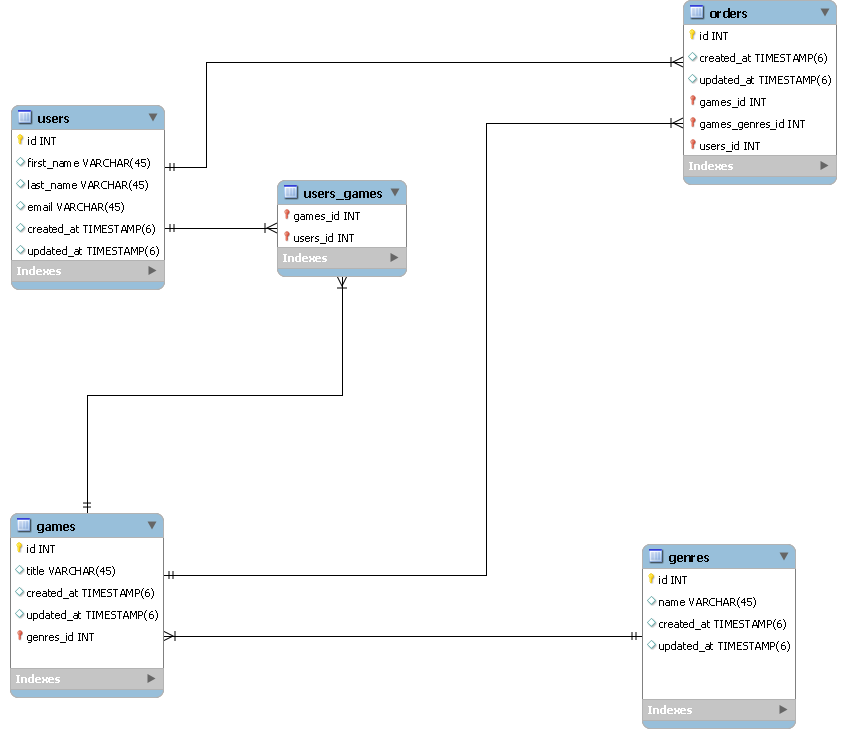

<h1 align="center">
Desafio 06 e 07 concluídos - Database Queries & Modelagem
</h1>

## 💫 Sobre o desafio 06
Nesse desafio, você realizará consultas no banco de dados com o TypeORM de três maneiras:

- Usando o ORM
- Usando Query Builder
- Usando Raw Query

Isso irá te ajudar a entender e exercitar os diferentes tipos de consultas que podemos fazer.

No template, você irá encontrar uma aplicação já estruturada (apenas as entidades e repositórios) onde você deverá completar o que falta nas consultas dos dois repositórios.

A aplicação possui dois módulos: `users` e `games`. Um **usuário** pode ter vários jogos e um mesmo **jogo** pode estar associado a vários usuários.

## ✅ Testes

## 🚀 Tecnologias

## 💫 Sobre o desafio 07
A aplicação deve ter uma tabela de gêneros (`genres`) para que cada jogo possa ter um ou mais gênero e, além disso, uma tabela `orders` deve existir para que um usuário consiga comprar um ou mais jogos na mesma compra.
Um extra seria colocar as cardinalidades entre as entidades mas não tome isso como obrigatório.

## 📃 Diagrama de EER

---
